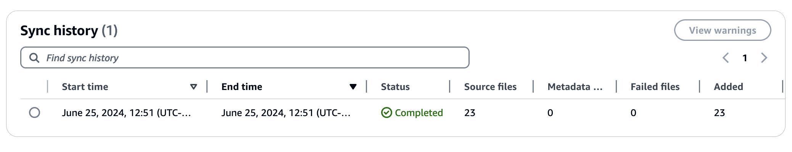
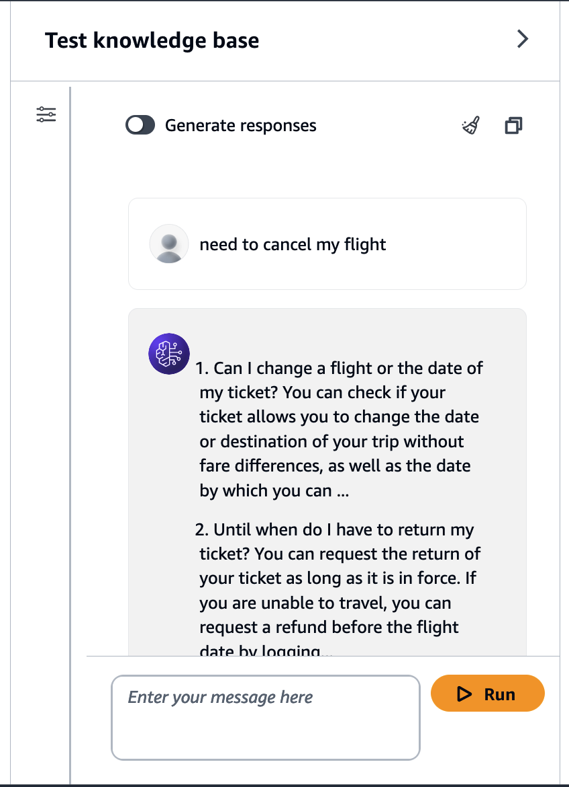

# Part 2: Create a Knowledge Base for Amazon Bedrock using Aurora PostgreSQL. 

Welcome to the second part of our series on building a WhatsApp-powered RAG Travel Support Agent. In this installment, we'll focus on setting up a Knowledge Base for Amazon Bedrock, leveraging the Aurora PostgreSQL database we created in [Part 1.](https://github.com/build-on-aws/rag-postgresql-agent-bedrock/tree/main/01-create-aurora-pgvector#readme)


## Overview

In this part, we'll accomplish the following:

1. Set up a Knowledge Base for Amazon Bedrock
2. Configure an Amazon S3 bucket as a data source
3. Create necessary [AWS Identity and Access Management (IAM) role](https://docs.aws.amazon.com/bedrock/latest/userguide/knowledge-base-create.html#kb-create-security) and permissions
4. Store relevant information in the AWS Systems Manager Parameter Store

## The Knowledge Base Process

Our Knowledge Base will automatically process unstructured text data stored in an Amazon S3 bucket. It will:

1. Convert the data into text chunks
2. Generate vector embeddings for these chunks
3. Store both the chunks and vectors in our PostgreSQL database

The data we're using consists of [PDFs containing information about common](https://github.com/build-on-aws/rag-postgresql-agent-bedrock/tree/main/02-create-bedrock-knowledge-bases/airline-qa-base/PDF) issues faced by a generic airline, providing a robust foundation for our travel support agent.

## Key Components

### 1. Amazon S3 Data Source

We use an S3 bucket to store our raw data (PDFs). This allows for easy updates and management of our knowledge base content.

### 2. Amazon Bedrock Knowledge Base

The Knowledge Base service will handle the ingestion, processing, and storage of our data, making it readily available for our AI model to query.

### 3. IAM Role

We'll create an IAM role with specific permissions to allow the Knowledge Base service to interact with other AWS services securely.

## IAM Role Permissions

The [IAM role](https://github.com/build-on-aws/rag-postgresql-agent-bedrock/blob/main/02-create-bedrock-knowledge-bases/kb_role/create_role.py) we create will have the following allowed actions:

- `bedrock:InvokeModel`
- `secretsmanager:GetSecretValue`
- `rds:DescribeDBClusters`
- `rds-data:BatchExecuteStatement`
- `rds-data:ExecuteStatement`
- `s3:Get*`
- `s3:ListBucket`

These permissions enable the Knowledge Base to access the necessary AWS services and perform required operations.


## The LLM 

You use a LLM to convert pieces of text to a vector. It is configured to use 


in [create_bedrock_knowledge_bases_stack.py](./create_bedrock_knowledge_bases/create_bedrock_knowledge_bases_stack.py):
```python
model_id = "amazon.titan-embed-text-v2:0"
```

Feel free to explore other supported Enbedding models, while maintaining 1024 as vector dimension.

Remember to [enable model Access](https://docs.aws.amazon.com/bedrock/latest/userguide/model-access.html) for this model.


## Prerequisites

Before we begin, ensure you have:

- Completed Parts 1 of this series


## ✅ Getting Started

1. Navigate to the project directory:
```
cd 02-create-bedrock-knowledge-bases
```

2. Set up a virtual environment:
```
python3 -m venv .venv
source .venv/bin/activate
```
For Windows:
```
.venv\Scripts\activate.bat
```

3. Install the required dependencies:
```
pip install -r requirements.txt
```

4. Deploy the CDK stack:
```
cdk deploy
```

## ✅ Key Configurations

- Knowledge Base configuration can be found in the [knowledgebase.py](https://github.com/build-on-aws/rag-postgresql-agent-bedrock/blob/main/02-create-bedrock-knowledge-bases/knowledge_base/knowledgebase.py) code in the CDK stack.
- S3 bucket data source configuration is in the [datasource.py](https://github.com/build-on-aws/rag-postgresql-agent-bedrock/blob/main/02-create-bedrock-knowledge-bases/knowledge_base/datasource.py) code.


### Test your Knowledge Base

Go to [Amazon Bedrock console](https://us-east-1.console.aws.amazon.com/bedrock/home?region=us-east-1#/knowledge-bases/) and look at your newly created Knowledge Base. In the datasources section click the Datasource **Bedrock-airline-qa**, view the Sync history, it should look like this:



Use the **Test Knowledge base** tool to check if your KB is working OK.





## 💰 Associated Costs

Be mindful of the costs associated with:

- [Amazon Bedrock Pricing](https://aws.amazon.com/bedrock/pricing/)
- [Amazon S3 Pricing](https://aws.amazon.com/s3/pricing/)
- [AWS Systems Manager pricing](https://aws.amazon.com/systems-manager/pricing/)

## Next Steps

With your Knowledge Base now set up and populated with airline-related information, you're ready to move on to the next part of our series. In Part 3, we'll build an Agent for Amazon Bedrock that can search this Knowledge Base and manage data in Amazon DynamoDB, bringing us closer to our complete travel support solution.
