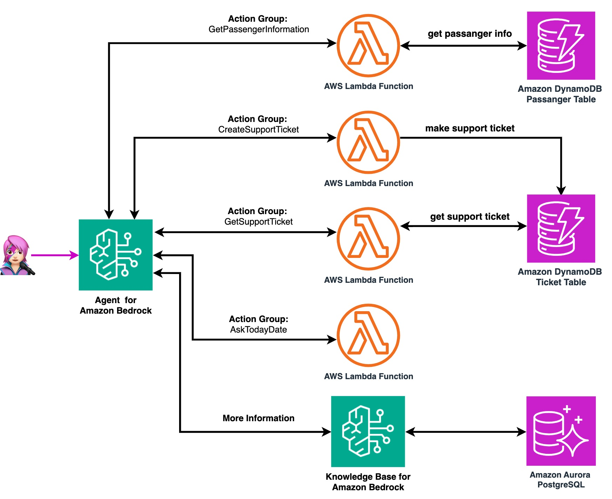
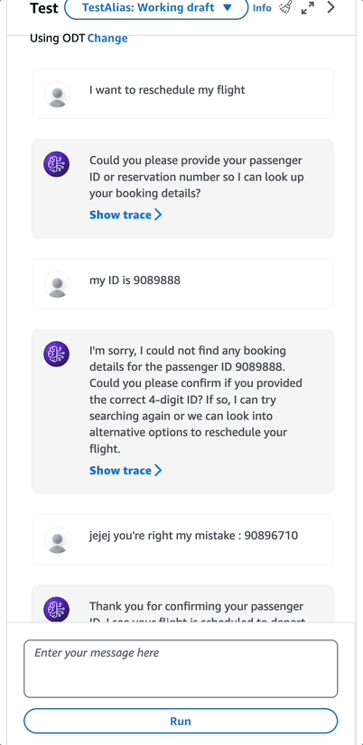
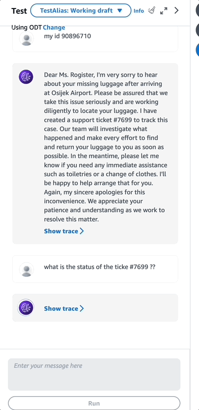

# Part 3: Create an Agent for Amazon Bedrock that can search a knowledge base, as well as insert and query data in an Amazon DynamoDB database.

Welcome to the third installment of our series on building a WhatsApp-powered RAG Travel Support Agent. In our previous parts, we laid the groundwork by setting up an Amazon Aurora PostgreSQL vector database and creating a Knowledge Base for Amazon Bedrock. Now, we're ready to take a significant step forward by creating an intelligent Agent for Amazon Bedrock that can efficiently search our Knowledge Base and manage data within an Amazon DynamoDB table.

## Overview of the Setup Process

In this part, with [AWS Cloud Development Kit (CDK)](https://aws.amazon.com/cdk) for Pytho we'll create an Agent for Amazon Bedrock  that serves as the interface between the user and our AI-powered travel support system. This agent will be capable of:

1. Searching the Knowledge Base we created in Part 2 for relevant travel information.
2. Interacting with an Amazon DynamoDB table to manage passenger ([with this data](https://github.com/build-on-aws/rag-postgresql-agent-bedrock/blob/main/03-rag-agent-bedrock/lambdas/code/dynamodb_put_item_from_csv/dataset.csv)) [from Kaggle](https://www.kaggle.com/datasets/iamsouravbanerjee/airline-dataset). information and support tickets.
3. Performing various actions through predefined action groups, including retrieving passenger data, creating support tickets, and checking ticket status.

## Key Components

This agent will include the following key components:

- Knowledge Base integration for contextual information retrieval.
- Action groups for specific tasks (AskTodayDAy, GetPassengerInformation, CreateSupportTicket, GetSupporTicketStatus)
- AWS Lambda functions to handle backend logic for each action group.
- Amazon DynamoDB table interactions for data management.
- Automated date and time retrieval functionality. 



## Prerequisites

- Completed Parts 1 and 2 of this series

## ✅ Key Configurations

- Agent for Amazon Bedrock configuration can be found in the [create_agent_with_kb_ag.py](https://github.com/build-on-aws/rag-postgresql-agent-bedrock/blob/main/03-rag-agent-bedrock/agent_bedrock/create_agent_with_kb_ag.py) code in the CDK stack.
- [AWS Identity and Access Management (IAM) role](https://docs.aws.amazon.com/bedrock/latest/userguide/knowledge-base-create.html#kb-create-security) for Agent permision is in the [create_role.py](https://github.com/build-on-aws/rag-postgresql-agent-bedrock/blob/main/03-rag-agent-bedrock/agent_role/create_role.py) code.
- Principal Stack. 

### LLM Use

In this project you use Anthropic's Claude 3 Sonnet. A good balance in speed and capabilities. If you want to change it to [other supported model](https://docs.aws.amazon.com/bedrock/latest/userguide/agents-supported.html) go to [agent_data.json](./rag_agent_bedrock/agent_data.json)


```json
"foundation_model": "anthropic.claude-3-sonnet-20240229-v1:0"
```


## ✅ Getting Started

Let's set up our development environment:

1. Navigate to the project directory:
```
cd 03-rag-agent-bedrock
```

2. Create and activate a virtual environment:
```
python3 -m venv .venv
source .venv/bin/activate
```
For Windows:
```
.venv\Scripts\activate.bat
```

3. Install the required dependencies:
```
pip install -r requirements.txt
```

4. Deploy the CDK stack:
```
cdk deploy
```

### Test the Agent

Go to [Amazon Bedrock > Agents](https://us-east-1.console.aws.amazon.com/bedrock/home?region=us-east-1#/agents) and simulate the interaction:

| Reschedule a Flight | Lost Luggage |
|-----------------|-----------------|
|  |  |

You can use passenger ID : *90896710* (or other from the [synthetic data](https://github.com/build-on-aws/rag-postgresql-agent-bedrock/blob/main/03-rag-agent-bedrock/lambdas/code/dynamodb_put_item_from_csv/dataset.csv) created in the DynamoDB Table )


## 💰 Associated Costs

- [Amazon Bedrock Pricing](https://aws.amazon.com/bedrock/pricing/)
- [Amazon S3 Pricing](https://aws.amazon.com/s3/pricing/)
- [AWS Systems Manager pricing](https://aws.amazon.com/systems-manager/pricing/)

