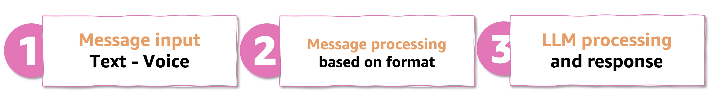
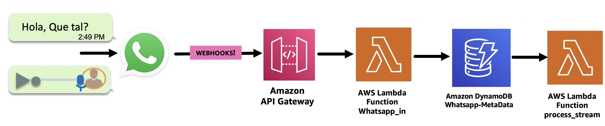
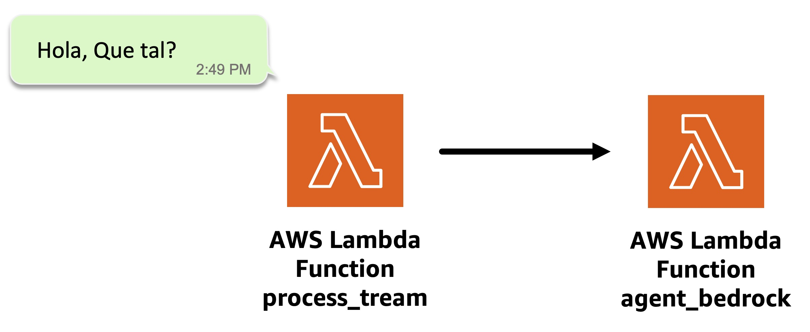
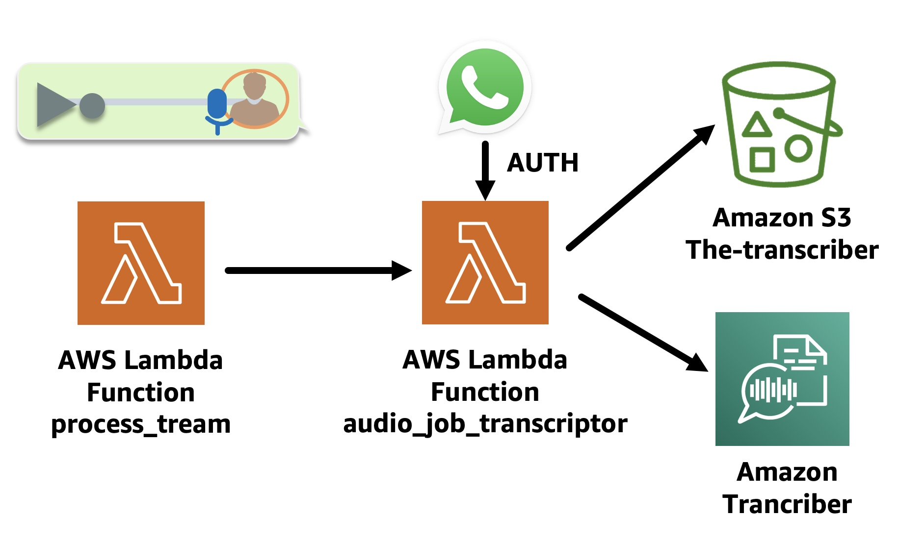
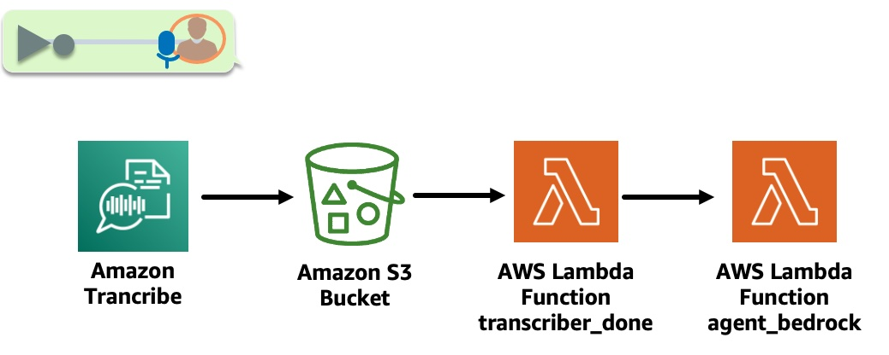
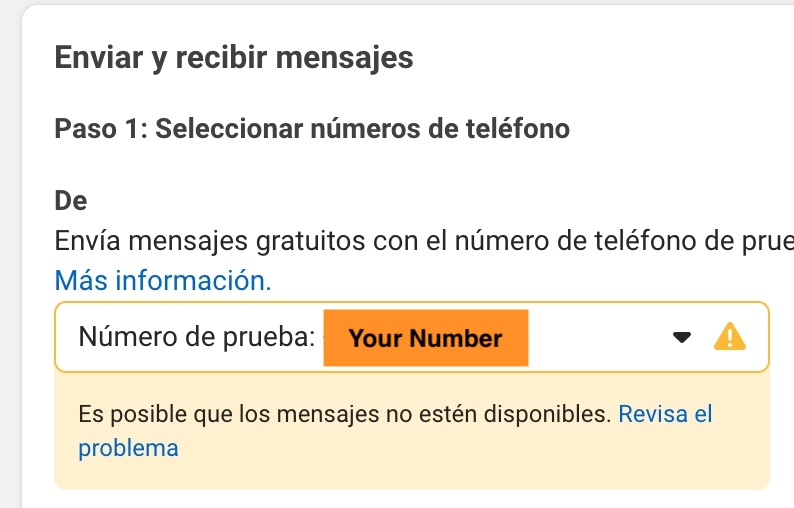
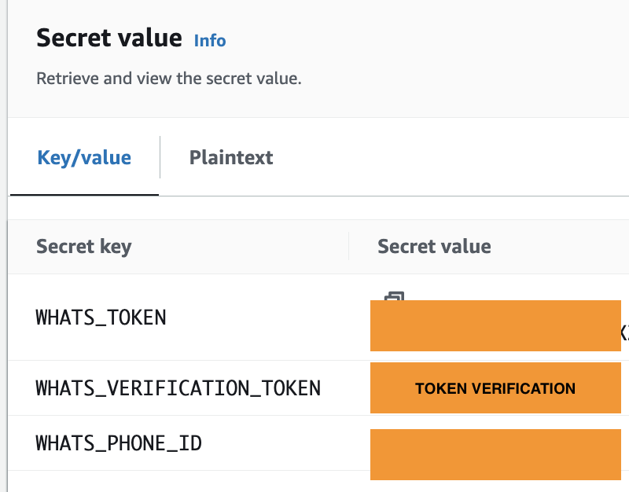
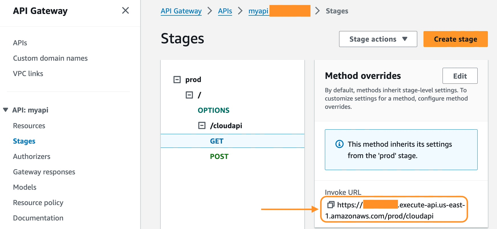
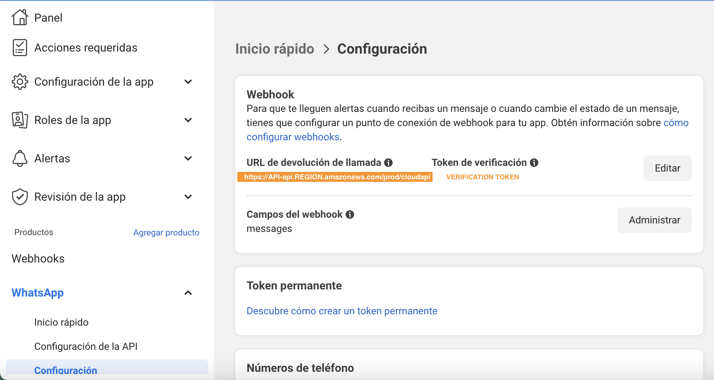
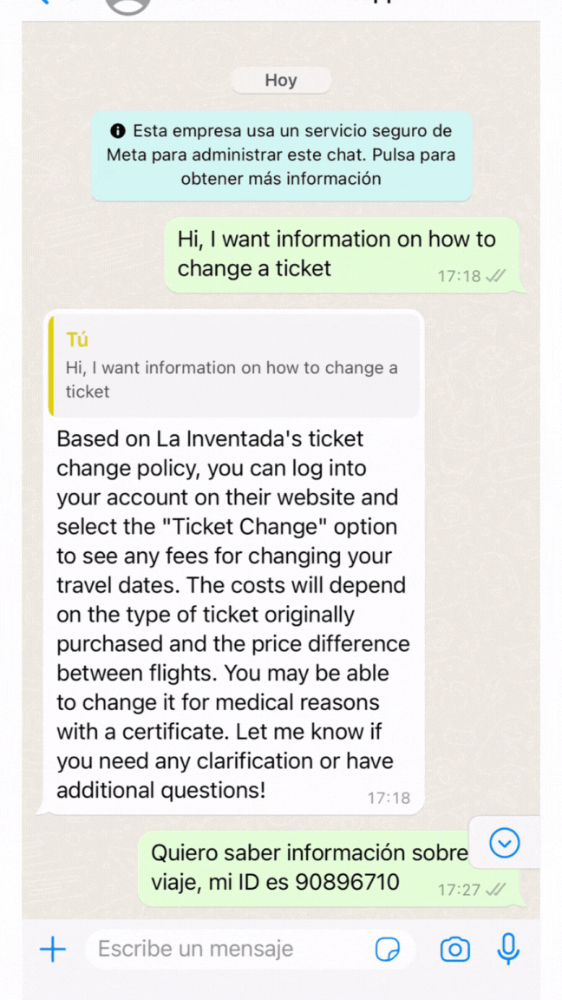

# Part 4: Enhanced User Interaction: Integrating a WhatsApp Assistant with Amazon Bedrock Agent.

Welcome to the final installment of our four-part series on building an advanced WhatsApp-powered RAG Travel Support Agent. In this part, we'll bring everything together by integrating our Amazon Bedrock agent with a WhatsApp interface, creating a powerful and user-friendly travel support assistant.

>🚨 Your data will be securely stored in your AWS account and will not be shared or used for model training. It is not recommended to share private information because the security of data with WhatsApp is not guaranteed.

## 💰 Cost To Complete: 
- [Whatsapp pricing](https://developers.facebook.com/docs/whatsapp/pricing/)
- [Amazon ApiGateway](https://aws.amazon.com/api-gateway/pricing/)
- [Amazon Transcribe Pricing](https://aws.amazon.com/transcribe/pricing/)
- [Amazon DynamoDB Pricing](https://aws.amazon.com/dynamodb/pricing/)
- [Amazon S3 Pricing](https://aws.amazon.com/s3/pricing/)
- [Amazon Lambda Pricing](https://aws.amazon.com/lambda/pricing/)

## How The App Works



Our final architecture integrates various AWS services to create a robust workflow:

### Phase 1. - Message Input:



1. WhatsApp receives the message: voice/text.
2. [Amazon API Gateway](https://aws.amazon.com/api-gateway/) receives the message from the [WhatsApp webhook](https://business.whatsapp.com/blog/how-to-use-webhooks-from-whatsapp-business-api) (previously authenticated).
3. Then, an [AWS Lambda Functions](https://aws.amazon.com/es/pm/lambda) named [whatsapp_in](./lambdas/code/whatsapp_in/lambda_function.py) processes the message and sends it to an [Amazon DynamoDB](https://aws.amazon.com/pm/dynamodb/) table named whatsapp-metadata to store it.
4. The DynamoDB table whtsapp-metadata has a [DynamoDB streaming](https://docs.aws.amazon.com/amazondynamodb/latest/developerguide/Streams.html) configured, which triggers the [process_stream](./lambdas/code/process_stream/lambda_function.py) Lambda Function.

### Phase 2. - Message processing:

**Text Message:**


[process_stream](./lambdas/code/process_stream/lambda_function.py) Lambda Function sends the text of the message to the lambda function named [agent_bedrock](./lambdas/code/agent_bedrock/lambda_function.py) (in the next step we will explore it).

**Voice Message:**



- The [audio_job_transcriptor](./lambdas/code/audio_job_transcriptor/lambda_function.py) Lambda Function is triggered. This Lambda Function downloads the WhatsApp audio from the link in the message in an [Amazon S3](https://aws.amazon.com/es/s3/) bucket, using Whatsapp Token authentication, then converts the audio to text using the Amazon Transcribe [start_transcription_job](https://boto3.amazonaws.com/v1/documentation/api/latest/reference/services/transcribe/client/start_transcription_job.html) API, which leaves the transcript file in an Output Amazon S3 bucket.

Function that invokes audio_job_transcriptor looks like this:

```python
def start_job_transciptor (jobName,s3Path_in,OutputKey,codec):
    response = transcribe_client.start_transcription_job(
            TranscriptionJobName=jobName,
            IdentifyLanguage=True,
            MediaFormat=codec,
            Media={
            'MediaFileUri': s3Path_in
            },
            OutputBucketName = BucketName,
            OutputKey=OutputKey 
            )
```
            
> 💡  Notice that the IdentifyLanguage parameter is configured to True. Amazon Transcribe can determine the primary language in the audio.
  


- The [transcriber_done](./lambdas/code/transcriber_done/lambda_function.py) Lambda Function is triggered with an [Amazon S3 Event Notification put item](https://docs.aws.amazon.com/AmazonS3/latest/userguide/EventNotifications.html) once the Transcribe Job is complete. It extracts the transcript from the Output S3 bucket and sends it to [agent_bedrock](./lambdas/code/agent_bedrock/lambda_function.py).


```Python
try:       
    response_3 = lambda_client.invoke(
        FunctionName = LAMBDA_AGENT,
        InvocationType = 'Event' ,#'RequestResponse', 
        Payload = json.dumps({
            'whats_message': text,
            'whats_token': whats_token,
            'phone': phone,
            'phone_id': phone_id,
            'messages_id': messages_id

        })
    )

    print(f'\nRespuesta:{response_3}')

    return response_3
    
except ClientError as e:
    err = e.response
    error = err
    print(err.get("Error", {}).get("Code"))
    return f"Un error invocando {LAMBDA_AGENT}
```
### Phase 3. Amazon Bedrock Agent Processing:

- Utilizes the agent we created in Part 3 to understand and respond to user queries.
- Leverages the knowledge base built on Aurora PostgreSQL for information retrieval.
- Interacts with DynamoDB for passenger information and support ticket management.

This is the key code in [agent_bedrock](./lambdas/code/agent_bedrock/lambda_function.py) Lambda Function that invokes the agent: 

```python
response = bedrock_agent_client.invoke_agent(
            agentId=agent_id,
            agentAliasId=agent_alias_id,
            sessionId=session_id,
            inputText=prompt,
        )
        print("response: ",response)

        completion = ""

        for event in response.get("completion"):
            chunk = event["chunk"]
            completion = completion + chunk["bytes"].decode()
```

### Phase 4. Response Handling:

- Send the response to WhatsApp through `whatsapp_out` the Lambda Function.

## Implementation Steps

### Step 1: Activate WhatsApp account Facebook Developers

1- [Get Started with the New WhatsApp Business Platform](https://www.youtube.com/watch?v=CEt_KMMv3V8&list=PLX_K_BlBdZKi4GOFmJ9_67og7pMzm2vXH&index=2&t=17s&pp=gAQBiAQB)

2- [How To Generate a Permanent Access Token — WhatsApp API](https://www.youtube.com/watch?v=LmoiCMJJ6S4&list=PLX_K_BlBdZKi4GOFmJ9_67og7pMzm2vXH&index=1&t=158s&pp=gAQBiAQB)

3- [Get started with the Messenger API for Instagram](https://www.youtube.com/watch?v=Pi2KxYeGMXo&list=PLX_K_BlBdZKi4GOFmJ9_67og7pMzm2vXH&index=5&t=376s&pp=gAQBiAQB)

### Step 2: Configure the Application
✅ **Go to**: 
```bash
cd 04-whatsapp-bedrock-agent
```
✅ **Edit the phone number**: 

In [whatsapp_app_stack.py](./whatsapp_app/whatsapp_app_stack.py) edit this line with the whatsapp Facebook Developer app number: 

`
DISPLAY_PHONE_NUMBER = 'YOUR-WHATSAPP-NUMBER'
`



### Step 3: Deploy architecture with CDK.

✅ **Create The Virtual Environment**:

```
python3 -m venv .venv
```

```
source .venv/bin/activate
```
for windows: 

```
.venv\Scripts\activate.bat
```

✅ **Install The Requirements**:

```
pip install -r requirements.txt
```

✅ **Synthesize The Cloudformation Template With The Following Command**:

```
cdk synth
```

✅🚀 **The Deployment**:

```
cdk deploy
```

### Step 4: WhatsApp Configuration

Edit WhatsApp configuration values in Facebook Developer in [AWS Secrets Manager](https://aws.amazon.com/secrets-manager/) [console](https://console.aws.amazon.com/secretsmanager/).



> ✅ The **verification token** is any value, but it must be the same in step 3 and 4.

✅ **Webhook Configuration:**

1. Go to [Amazon API Gateway Console](https://console.aws.amazon.com/apigateway)
2. Click on `myapi`.
3. Go to **Stages** -> **prod** -> **/cloudapi** -> **GET**, and copy **Invoke URL**. 



4. Configure Webhook in the Facebook developer application. 
    - Set **Invoke URL**.
    - Set **verification token**.





## Enjoy the app!:

1. **General Queries**: Ask travel-related questions to test the knowledge base integration.


2. **Passenger Information**: Use sample passenger IDs to request information from DynamoDB.


> The multilanguage function depends on the [LLM you use](https://aws.amazon.com/bedrock/).

3. **Support Ticket Creation**: Test the ability to create and query support tickets.

4. **Voice Messages**: Send voice notes to test the audio transcription and processing pipeline.




## Conclusion

This enhanced WhatsApp Travel Assistant demonstrates the power of AWS's integrated AI and database services. By leveraging Amazon Bedrock's agent and knowledge base capabilities, along with Aurora PostgreSQL and DynamoDB, we've created a more streamlined, powerful, and maintainable solution.

The addition of the support ticket system provides a complete end-to-end customer service experience, allowing for seamless escalation of complex issues while maintaining the benefits of AI-powered initial interactions.

We encourage you to build upon this foundation, perhaps by expanding the knowledge base, fine-tuning the Bedrock agent's responses, or integrating with additional travel-related services.

Thank you for joining us on this journey to revolutionize travel customer support with AWS technologies!
